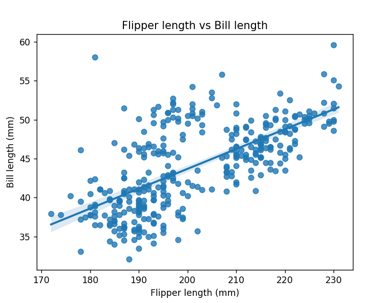
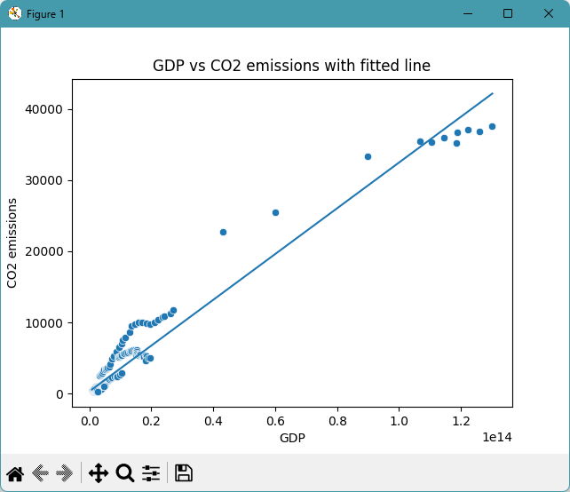

# datafun-07-regression

[](https://denisecase.github.io/pro-analytics-02/workflow-b-apply-example-project/)
[](./pyproject.toml)
[](./LICENSE)

> Professional Python project: linear regression and predictive analytics.

## Project Goal

This project introduces **linear regression**, the process of
fitting a model to data and using it to make predictions.

Think about two variables that might be related:

- Does study time predict exam scores?
- Does temperature predict energy usage?
- Does advertising spend predict revenue?

Your goal: run the example, read the code,
and apply the same approach to a dataset and question of your own choosing.

For data suggestions, please see [data/raw/README.md](data/raw/README.md).

## Working Files

You'll work with just these areas:

- **data/raw** - raw data for exploration
- **docs/** - project narrative and documentation
- **src/** - supporting Python package modules
- **notebooks/** - interactive analysis
- **pyproject.toml** - update authorship & links
- **zensical.toml** - update authorship & links

## Instructions (pro-analytics-02)

Follow the
[step-by-step workflow guide](https://denisecase.github.io/pro-analytics-02/workflow-b-apply-example-project/)
to complete:

1. Phase 1. **Start & Run**
2. Phase 2. **Change Authorship**
3. Phase 3. **Read & Understand**
4. Phase 4. **Modify**
5. Phase 5. **Apply**

## Challenges

Challenges are expected.
Sometimes instructions may not quite match your operating system.
When issues occur, share screenshots, error messages, and details about what you tried.
Working through issues is part of implementing professional projects.

## Success

After completing Phase 1. **Start & Run**, you'll have your own GitHub project,
running on your machine, and running the example will print out:

```shell
========================
Executed successfully!
========================
```

A new file `project.log` will appear in the root project folder.

## Command Reference

<details>
<summary>Show command reference</summary>

### In a machine terminal (open in your `Repos` folder)

After you get a copy of this repo in your own GitHub account,
open a machine terminal in your `Repos` folder:

```shell
# Replace username with YOUR GitHub username.
git clone https://github.com/parkslarryjr/datafun-07-regression

cd datafun-07-regression
code .
```

### In a VS Code terminal

```shell
uv self update
uv python pin 3.14
uv lock --upgrade
uv sync --extra dev --extra docs --upgrade

uvx pre-commit install

git add -A
uvx pre-commit run --all-files
# repeat if changes were made
uvx pre-commit run --all-files

# run the penguin example: is there a linear relationship?
uv run python -m datafun.app_penguins_case

# run the co2 example: is there a linear relationship?
# the line fits poorly; why?  what would you change?
uv run python -m datafun.app_co2_case

# do chores
uv run python -m pyright
uv run python -m pytest
uv run python -m zensical build

# save progress
git add -A
git commit -m "update"
git push -u origin main
```

</details>

## Notes

- Use the **UP ARROW** and **DOWN ARROW** in the terminal to scroll through past commands.
- Use `CTRL+f` to find (and replace) text within a file.
- You do not need to add to or modify `tests/`. They are provided for example only.
- Many files are silent helpers. Explore as you like, but nothing is required.
- You do NOT not to understand everything; understanding builds naturally over time.

## Troubleshooting >>>

If you see something like this in your terminal: `>>>` or `...`
You accidentally started Python interactive mode.
It happens.
Press `Ctrl+c` (both keys together) or `Ctrl+Z` then `Enter` on Windows.

## Example Output

```shell
| INFO | P07 | ========================
| INFO | P07 | Dataset: owid-co2-data-subset
| INFO | P07 | Feature (x): gdp
| INFO | P07 | Target  (y): co2
| INFO | P07 | Original rows: 350
| INFO | P07 | Model rows:    308
| INFO | P07 | Fitted line:
| INFO | P07 |   co2 = 3.21582e-10 * gdp + 308.446
| INFO | P07 | ======================
| INFO | P07 | Review the fit numbers (R-squared, RMSE).
| INFO | P07 | Look at the fitted-line plot and the residual plot.
| INFO | P07 | Decide whether a straight line is a fair description here.
| INFO | P07 | If the residuals show a pattern, a straight line is not -
| INFO | P07 | and that is a real finding worth reporting.
| INFO | P07 | ======================
| INFO | P07 | Repeat with a different feature, or a transformed feature,
| INFO | P07 | to investigate other angles.
| INFO | P07 | ======================
| INFO | P07 | Include instructions and specifics in your README.md file.
| INFO | P07 | Write up your narrative on your docs/index.md file.
| INFO | P07 | Include your next step suggestions for further analysis or modeling.
| INFO | P07 | ======================
| INFO | P07 | ----- in a script, call plt.show() once at the end to display all charts -----
| INFO | P07 | ----- in a script, close the chart windows (with the close button) to continue  -----
| INFO | P07 | Linear regression workflow complete
| INFO | P07 | IMPORTANT: This script creates chart windows.
| INFO | P07 | Close any chart windows and terminate this process with CTRL+c as needed.
| INFO | P07 | ========================
| INFO | P07 | Executed successfully!
| INFO | P07 | ========================
```

## Findings and Visuals

Take screenshots of your charts and provide them here with a discussion.
In Markdown, display a figure by using:
an exclamation mark immediately followed by square brackets containing a useful caption
immediately followed by parentheses containing the relative path to your figure.
Note: When you start typing the path with a dot (.) for "here, in this directory",
the IDE may help complete the path.

In your custom project, discuss these examples, but

- your figures and narrative should reflect your work,
- this `README.md` should include your commands, process, and visuals, and
- `docs/index.md` should include your narrative.

Remove unnecessary instructional comments in your custom files.

Update these figures to present interesting results from your custom project:

## Penguins: Is there a linear relationship?

Yes, there is a clear positive linear relationship between flipper length and body mass. As flipper length increases, body mass generally increases as well, and the points follow a fairly straight pattern.


### Penguins: Technical Modification
As a technical modification, I added a regression plot comparing flipper length and bill length. This graph explores the relationship between two different body measurements rather than the original relationship between flipper length and body mass.

The plot shows a positive relationship between flipper length and bill length, meaning penguins with longer flippers tend to have longer bills. While the relationship is not as strong as the relationship between flipper length and body mass, there is still an observable upward trend in the data. The regression line helps visualize this trend and provides another example of how linear regression can be used to investigate relationships between variables.



### Phase 5: (CO₂ Exploration)

For Phase 5, I explored a new regression problem using GDP and CO₂ emissions from the OWID dataset. Unlike the penguin example, this relationship was less clearly linear.

The initial scatter plot of GDP vs CO₂ showed curvature and spread, suggesting that a straight-line model does not fully describe the relationship. This indicates that CO₂ emissions are influenced by multiple factors beyond GDP.

To explore this further, I applied a logarithmic transformation to both variables, creating a LOG(GDP) vs LOG(CO₂) model. This transformation produced a much more linear pattern and improved the overall relationship.


A possible reason for the improvement is that the relationship between GDP and CO₂ is multiplicative rather than additive. In addition, other variables such as population size, energy efficiency, and national policies likely influence emissions and create variation in the original model.


## World Data: Is there a linear relationship? How can you improve the analysis?
There is a weak linear relationship between GDP and CO2 emissions. The data is widely spread out, so GDP does not strongly predict CO2 using a straight-line model.

The analysis could be improved by trying additional variables, transforming the data (such as using logarithms), or using a more complex model instead of a simple linear regression.

### Reflection

This project helped reinforce how linear regression can be used to explore real-world relationships and how important it is to evaluate model fit using visualizations and residuals.

In the penguin dataset, the relationship was clearly linear and easy to interpret. In contrast, the CO₂ dataset required deeper analysis and transformation to reveal a clearer pattern.

I learned that logarithmic transformations can help uncover hidden linear relationships in real data. I also learned that not all relationships are naturally linear, and that additional variables often play an important role.

If I had more time, I would extend the CO₂ analysis by including additional variables such as population or CO₂ per capita, or by adding time (year) to explore how the relationship changes over time.

Overall, this project demonstrates how regression is not just about fitting a line, but about interpreting what the data is actually showing.




## Project Documentation

Additional instructions, terms, and project notes:

[docs/index.md](docs/index.md)

## Citation

[CITATION.cff](./CITATION.cff)

## License

[MIT](./LICENSE)
