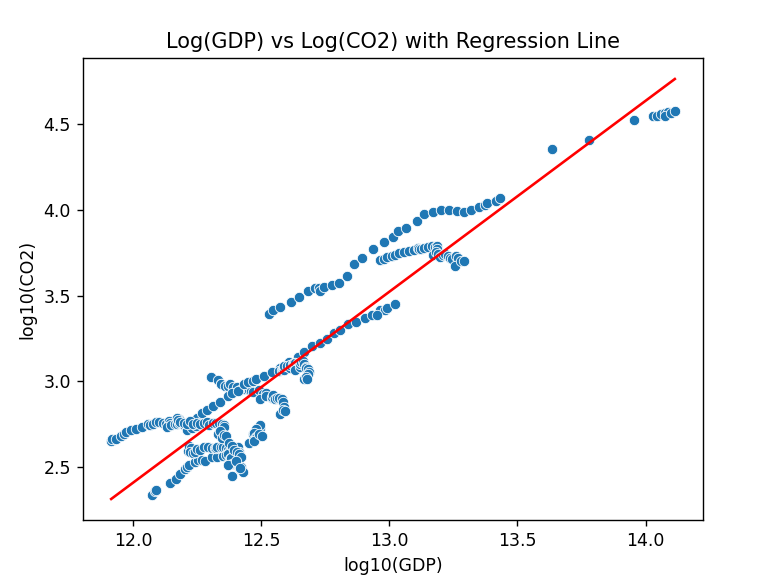

# Project Documentation

This site provides project documentation.
Use the documentation navigation to explore.

## How-To Guide

Many instructions are common to all our projects.

See
[⭐ **Workflow: Apply Example**](https://denisecase.github.io/pro-analytics-02/workflow-b-apply-example-project/)
to get these projects running on your machine.

## Project Documentation Pages (docs/)

- **Home** - this documentation landing page
- [**Project Instructions**](./project-instructions.md)  - the standard project workflow
- [**Your Files**](./your-files.md) - how to copy the example and create your version
- [**Glossary**](./glossary.md) - project terms and concepts
- [**API**](./api.md) - autogenerated code documentation for the public project interface

The API page is not always easy to read at first,
but it becomes useful as you get more comfortable with project structure,
modules, functions, and docstrings.

## Custom Project

### Basis

I used the Palmer Penguins dataset that was provided through Seaborn. The original example analyzed the relationship between flipper length and body mass using simple linear regression. I started with the provided workflow and explored how different penguin measurements relate to one another.

### Phase 4 Modifications

As my technical modification, I added a new regression plot comparing flipper length and bill length. I chose this relationship because it investigates whether different body measurements of penguins are related and provides an additional analysis beyond the original example.

To implement the modification, I added a Seaborn regression plot (sns.regplot) that displays the data points along with a best-fit regression line. I verified that the modification worked by running the program, confirming that the new graph appeared with the other visualizations, and checking that the regression line was displayed correctly on the scatter plot.

### Phase 5 Custom Project

In this custom project, I explored a new regression problem using the CO₂ dataset. I did not modify the original example script. Instead, I used it as a guide to build my own analysis focused on the relationship between GDP and CO₂ emissions.

I selected GDP as the feature and CO₂ emissions as the target variable and applied a simple linear regression model. After running the initial model, I analyzed the scatter plot, regression line, residuals, and R-squared value. The results showed that the relationship was not perfectly linear and had visible curvature, suggesting that a simple straight-line model did not fully capture the pattern in the data.

To further explore this relationship, I applied a log transformation to both GDP and CO₂ emissions and created a new regression plot (Figure 6: LOG(GDP) vs LOG(CO₂)). This transformation made the relationship appear much more linear and easier to interpret. It suggested that the relationship between GDP and CO₂ is likely multiplicative rather than purely linear.

From this analysis, I observed that transforming the variables significantly improved the visual fit of the model and made the trend clearer. I learned that even small transformations like logarithms can reveal stronger patterns in real-world data and improve how well a linear regression represents the relationship.

This change was easy to moderate in difficulty. It was easy because the implementation only required applying a log transformation and re-plotting the data. It was moderate because interpreting why the transformation improved the relationship required deeper thinking about what the data represents.

If I had more time, I would explore additional variables such as population or CO₂ per capita, and I would also consider adding time (year) to examine how the relationship changes over time or across countries.

Overall, I practiced skills in regression modeling, data visualization, and interpretation of transformed relationships. These techniques could be applied to other real-world problems such as environmental impact analysis, economic modeling, or predicting emissions based on national development indicators.
